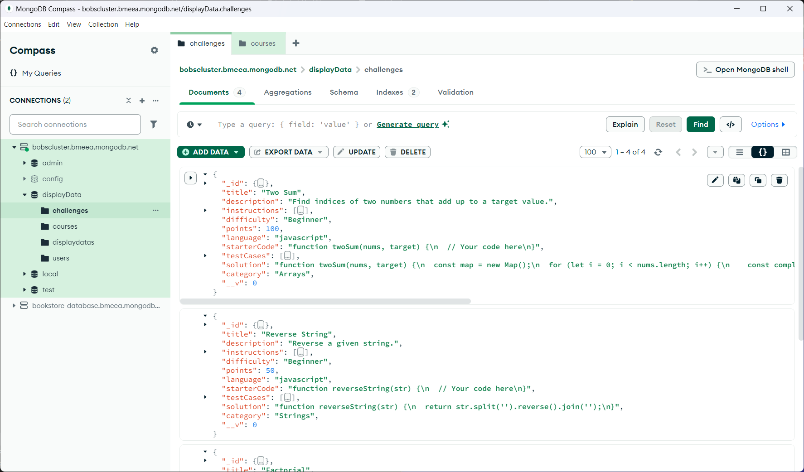

# Hack-on-PS008
# CodeQuest

CodeQuest is a full-stack coding challenge platform that enables users to log in via Google OAuth, attempt coding challenges, and track their progress on a personalized dashboard. The platform is built with React (using Vite), Tailwind CSS, and Node.js/Express with MongoDB. It also utilizes React Query for data fetching and vm2 for secure code execution in a sandboxed environment.

## Table of Contents

- [Features](#features)
- [Technologies Used](#technologies-used)
- [Project Structure](#project-structure)
- [Installation and Setup](#installation-and-setup)
  - [Backend Setup](#backend-setup)
  - [Frontend Setup](#frontend-setup)
- [Environment Variables](#environment-variables)
- [Seeding the Database](#seeding-the-database)
- [Usage](#usage)
- [Screenshots](#screenshots)
- [License](#license)

## Features

- **User Authentication:** Secure login with Google OAuth.
- **Challenges:** Browse and attempt a variety of coding challenges with an integrated code editor.
- **Dashboard:** Monitor your progress and view completed challenges.
- **Courses:** Explore sample courses for additional learning.
- **Secure Code Execution:** Execute code safely using vm2 sandboxing.

## Technologies Used

- **Frontend:**
  - React (with Vite)
  - React Router DOM
  - React Query
  - Tailwind CSS
  - Monaco Editor
- **Backend:**
  - Node.js / Express
  - MongoDB (via Mongoose)
  - Passport.js (Google OAuth strategy)
  - vm2 (for sandboxed code execution)
  - JSON Web Tokens (JWT) for authentication

## Project Structure

```
project-root/
├── client/
│   ├── index.html
│   ├── package.json
│   ├── vite.config.js
│   ├── tailwind.config.js
│   ├── postcss.config.js
│   └── src/
│       ├── App.jsx
│       ├── index.css
│       ├── main.jsx
│       ├── api/
│       │   └── challenges.js
│       ├── contexts/
│       │   └── AuthContext.jsx
│       ├── components/
│       │   ├── ProtectedRoute.jsx
│       │   ├── layout/
│       │   │   └── Navbar.jsx
│       │   ├── challenges/
│       │   │   ├── ChallengeCard.jsx
│       │   │   ├── ChallengeDetail.jsx
│       │   │   └── index.js
│       │   ├── editor/
│       │   │   └── CodeEditor.jsx
│       │   └── ui/
│       │       ├── Card.jsx
│       │       ├── Button.jsx
│       │       └── Alert.jsx
│       └── pages/
│           ├── Dashboard.jsx
│           ├── Challenges.jsx
│           ├── Courses.jsx
│           └── LoginPage.jsx
└── server/
    ├── package.json
    ├── .env
    ├── index.js
    ├── seedChallenges.js
    ├── seedCourses.js
    └── src/
        ├── app.js
        ├── config/
        │   └── passport.js
        ├── controllers/
        │   ├── challengeController.js
        │   └── courseController.js
        ├── middleware/
        │   └── auth.js
        ├── models/
        │   ├── Challenge.js
        │   ├── Course.js
        │   └── User.js
        ├── routes/
        │   ├── auth.js
        │   ├── challengeRoutes.js
        │   └── courseRoutes.js
        └── services/
            └── codeExecutionService.js
```

## Installation and Setup

### Backend Setup

1. **Navigate to the `server` directory:**

   ```bash
   cd server
   ```

2. **Install dependencies:**

   ```bash
   npm install
   ```

3. **Create a `.env` file in the server root** (see [Environment Variables](#environment-variables)).

4. **Seed the database with sample challenges and courses (optional):**

   ```bash
   node seedChallenges.js
   node seedCourses.js
   ```

5. **Start the server in development mode:**

   ```bash
   npm run dev
   ```

   The server should run on the port defined in your `.env` (default: 5000).

### Frontend Setup

1. **Navigate to the `client` directory:**

   ```bash
   cd client
   ```

2. **Install dependencies:**

   ```bash
   npm install
   ```

3. **Create a `.env` file in the client root with the following content:**

   ```
   VITE_API_URL=http://localhost:5000
   ```

4. **Start the development server:**

   ```bash
   npm run dev
   ```

   By default, Vite runs on port 5173; you can change this in `vite.config.js` if desired.

## Environment Variables

### Server (.env)

```env
PORT=5000
MONGODB_URI=mongodb+srv://<username>:<password>@yourcluster.mongodb.net/yourDatabase?retryWrites=true&w=majority
JWT_SECRET=your_jwt_secret
GOOGLE_CLIENT_ID=your_google_client_id
GOOGLE_CLIENT_SECRET=your_google_client_secret
GOOGLE_CALLBACK_URL=http://localhost:5000/auth/google/callback
CLIENT_URL=http://localhost:3000
```

### Client (.env)

```env
VITE_API_URL=http://localhost:5000
```

## Seeding the Database

- **Challenges:** Run `node seedChallenges.js` from the server folder to populate sample coding challenges.
- **Courses:** Run `node seedCourses.js` from the server folder to insert sample course data.

## Usage

1. **Login:**
   - Navigate to `http://localhost:3000` (or your configured port).
   - Click the "Sign in with Google" button to authenticate.
   - After logging in, you will be redirected to the Dashboard.

2. **Dashboard:**
   - View your progress stats and navigation options.
   - Use the Navbar to navigate between Dashboard, Challenges, and Courses.

3. **Challenges:**
   - Click on a challenge card to view details.
   - Use the integrated code editor to submit your solution.
   - A simple output will display whether your solution is correct or incorrect.

4. **Courses:**
   - The Courses page displays sample courses (which you seeded).

## Screenshots


